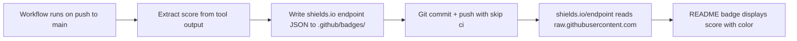

# Dynamic Score Badges for React Doctor & Lighthouse

## Problem

Both the **React Doctor** and **Lighthouse** badges in `README.md` currently use `img.shields.io/github/actions/workflow/status/...`, which only shows **pass/fail** (green/red). The goal is to display the **actual numeric score** in the badge.

## Approach: Commit Badge JSON to the Repo

Each workflow writes a small [shields.io endpoint JSON](https://shields.io/badges/endpoint-badge) file to `.github/badges/` and commits it on pushes to `main`. The README badges then reference these files via `raw.githubusercontent.com`.

**No Gist, no PAT token, no external services needed** — only the built-in `GITHUB_TOKEN`.



## Badge JSON Format

Each file follows the [shields.io endpoint schema](https://shields.io/badges/endpoint-badge):

```json
{
  "schemaVersion": 1,
  "label": "React Doctor",
  "message": "96/100",
  "color": "brightgreen",
  "namedLogo": "react"
}
```

Color is computed from the score:

- greater than or equal to 90 = `brightgreen`
- greater than or equal to 80 = `green`
- greater than or equal to 70 = `yellow`
- greater than or equal to 60 = `orange`
- less than 60 = `red`

## Files to Change

### 1. `.github/workflows/react-doctor.yml`

Add a new step after "Check score threshold" that only runs on `push` to `main`:

- Computes color from `steps.doctor.outputs.score_num`
- Writes `.github/badges/react-doctor-badge.json` with label, message, color, and logo
- Commits and pushes with `[skip ci]` in the commit message
- Requires `contents: write` permission added to the job

### 2. `.github/workflows/lighthouse.yml`

Add two new steps before "Stop server":

**Step A — Extract Lighthouse scores:**

- Finds the latest `.lighthouseci/lhr-*.json` file
- Uses `jq` to extract `performance`, `accessibility`, `best-practices`, and `seo` scores
- Multiplies each by 100 and rounds to get percentage values
- Outputs: `perf`, `a11y`, `bp`, `seo`, and a formatted `message`

**Step B — Write badge JSON and commit:**

- Only runs on `push` to `main`
- Computes color from the performance score
- Writes `.github/badges/lighthouse-badge.json` with all 4 scores in the message
- Commits and pushes with `[skip ci]`
- Requires `contents: write` permission added to the job

### 3. `README.md`

Replace two badge URLs:

**Line 4 — Lighthouse badge:**

```markdown
[](https://github.com/w3bdesign/dfweb-v4/actions/workflows/lighthouse.yml)
```

**Line 8 — React Doctor badge:**

```markdown
[](https://github.com/w3bdesign/dfweb-v4/actions/workflows/react-doctor.yml)
```

### 4. `.github/badges/` — New directory

Create initial placeholder files so badges render before the first workflow run:

- `.github/badges/react-doctor-badge.json`
- `.github/badges/lighthouse-badge.json`

Both initialized with `"message": "pending"` and `"color": "lightgrey"`.

## Commit Noise Mitigation

- Auto-commits use `[skip ci]` in the message to prevent cascading workflow triggers
- Only happens on `push` to `main`, not on PRs
- Each commit is tiny — one JSON file change

## Expected Badge Output

| Badge        | Example Display                                                                  |
| ------------ | -------------------------------------------------------------------------------- |
| React Doctor | `React Doctor - 96/100` with brightgreen color                                   |
| Lighthouse   | `Lighthouse - 100% perf / 100% a11y / 100% bp / 100% seo` with brightgreen color |

## Implementation Checklist

- [ ] Add `contents: write` permission to `react-doctor.yml` job
- [ ] Add badge JSON write + commit step to `react-doctor.yml`
- [ ] Add `contents: write` permission to `lighthouse.yml` job
- [ ] Add score extraction step to `lighthouse.yml`
- [ ] Add badge JSON write + commit step to `lighthouse.yml`
- [ ] Create `.github/badges/react-doctor-badge.json` placeholder
- [ ] Create `.github/badges/lighthouse-badge.json` placeholder
- [ ] Update `README.md` line 4 Lighthouse badge URL
- [ ] Update `README.md` line 8 React Doctor badge URL
