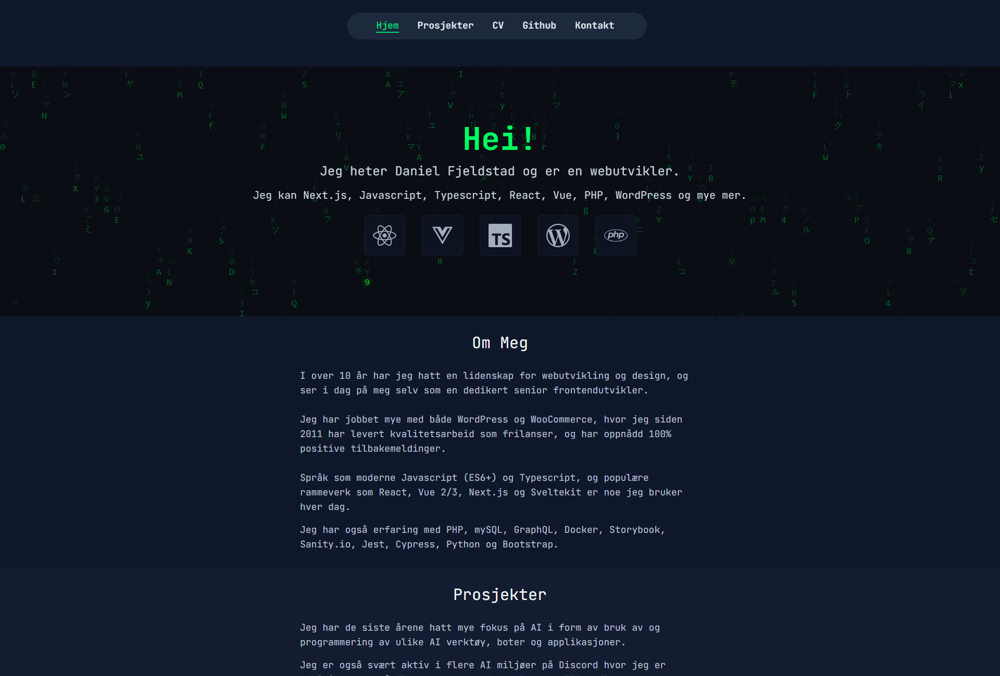

# Dfweb.no Portfolio Version 4

[](https://github.com/w3bdesign/dfweb-v4/actions/workflows/cypress.yml)
[](https://github.com/w3bdesign/dfweb-v4/actions/workflows/lighthouse.yml)
[](https://app.codacy.com/gh/w3bdesign/dfweb-v4/dashboard?utm_source=gh&utm_medium=referral&utm_content=&utm_campaign=Badge_grade)
[](https://codecov.io/gh/w3bdesign/dfweb-v4)
[](https://github.com/w3bdesign/dfweb-v4/actions/workflows/pa11y.yml)
[](https://codeclimate.com/github/w3bdesign/dfweb-v4/maintainability)

Fourth version of my personal portfolio website with Next.js, Motion,
Sanity.io and Typescript.

## Table of Contents

- [Live URL](#live-url)
- [Frontend (Next.js)](#frontend-nextjs)
- [Backend (Sanity headless CMS)](#backend-sanity-headless-cms)
- [Google Lighthouse](#google-lighthouse)
- [Features](#features)
  - [General](#general)
  - [Design](#design)
  - [Accessibility](#accessibility)
  - [Devops and Code quality](#devops-and-code-quality)
  - [Environment Variables](#environment-variables)
  - [Testing Standards](#testing-standards)

## Live URL

<https://www.dfweb.no>

## Frontend (Next.js)



---

## Backend (Sanity headless CMS)


---

## Google Lighthouse


## Features

### General

- Clean, modern, responsive and Matrix-inspired design
- The application is 100% typescript (the types are generated from Sanity typegen)
- Matrix canvas rain effect on front page
- Custom 404 page with Matrix rain effect
- Next.js 15 with Typescript and App router
  - Server Components implementation for improved performance
  - Streaming with Suspense boundaries
  - Automatic static optimization with revalidation
  - Server-side data fetching with proper error handling
- React 19
- Sanity headless CMS for all of the content, projects and navigation links
- Ladle for component documentation
- Animations with Motion
- React testing library for unit testing
- Cypress for E2E testing
- Playwright for cross-browser E2E testing
- Contact form with Email.js
- Polymorphic components
- Automatic sitemap generation (see /api/siteMapGenerator.ts)
- Google rich results for each individual page
- 100% / 100% / 100% / 100% score in Google Lighthouse
- Automated Lighthouse CI testing integrated with GitHub Actions
- React Hook Form with Typescript and Zod for efficient form handling and validation
- Reusable GenericForm component for easy form creation and management
- Error handling with react-error-boundary for improved user experience and
  easier debugging
- AI-friendly repository documentation with automated updates (Repomix with
  Github action workflow)
- Sanity image URL generation with automatic resizing via `@sanity/image-url`.
- Efficient data fetching in `/prosjekter` using Next.js preloading,
  React.cache, and server-only patterns, this achieves a LCP of 0.18s, down with
  around 1 second.
- Recommended:
  [Sanity VS Code Extension](https://marketplace.visualstudio.com/items?itemName=sanity-io.vscode-sanity)
  for enhanced GROQ query development, including syntax highlighting when using
  `defineQuery`.

### Design

- Fully responsive design tested on all devices
- React Icons for project icons
- Tailwind 14 for styling
- Animated reusable input fields
- Matrix-inspired animated cursor with dynamic trailing effect with fading
  Matrix characters

### Accessibility

- WCAG accessibility tested
- Accessibility testing with Cypress Axe and Pa11y
- Automated Pa11y accessibility testing on every PR and push to main
  - Tests all main pages against WCAG2AA standards
  - Captures screenshots for visual reference
  - Detailed reports available as GitHub Actions artifacts
- Builds will fail if any a11y errors are found

### Devops and Code quality

- Continuous Integration with CircleCI
- CircleCI will warn before deploy if tests fail (setup for React testing library)
- Github action workflow for Cypress
- Code quality analysis with Codacy, Sonarcloud and Codeclimate
- E2E testing with Cypress and Playwright integrated with Github actions
- Unit testing with Jest and React Testing Library integrated with CircleCI
- Test coverage setup with Codecov
- 100% test coverage with Jest and React testing library
- AI-powered commit message generation following Conventional Commits with
  gitmojis
- Automated pre-commit linting and formatting using Lefthook and lint-staged.
- Automated performance monitoring with Lighthouse CI
  - Performance, accessibility, best practices, and SEO checks on every PR
  - Configurable thresholds for quality metrics
  - Both desktop and performance-focused testing
- Automated repository documentation with Repomix
  - AI-friendly documentation generation on every push to main
  - Comprehensive repository context maintained in `DOCS/repository_context.txt`
  - Automated PR analysis with repository structure insights
  - Security-focused documentation with sensitive information filtering
  - Markdown formatting for improved readability
  - Automated security vulnerability scanning with Snyk
    - Scans for vulnerabilities in open-source dependencies on every PR and push to main
    - Integrates with GitHub Security tab for vulnerability tracking

### Environment Variables

- Type-safe environment variable validation with envalid

  - Runtime validation of required environment variables
  - Clear error messages with examples for missing variables
  - Separate handling of client-side and server-side variables
  - Default values where appropriate
  - Required variables:

    ```env
    # Email Configuration (client-side)
    NEXT_PUBLIC_EMAIL_API_KEY=user_xxx        # EmailJS API key
    NEXT_PUBLIC_EMAIL_TEMPLATE_KEY=template_xxx # EmailJS template key
    NEXT_PUBLIC_EMAIL_SERVICE_KEY=service_xxx  # EmailJS service key

    # AI Configuration (server-side)
    AI_API_KEY=xxx                            # AI service API key
    AI_BASE_URL=https://xxx                   # AI service base URL
    MODEL_NAME=claude-3.7-sonnet@anthropic    # Optional, has default value
    ```

  - Validation prevents application startup if required variables are missing
  - TypeScript integration for type-safe access to environment variables

### Testing Standards

- ISTQB-aligned comprehensive test strategy

  - Detailed test strategy documentation in `DOCS/TEST_STRATEGY.md`
  - Multi-level test approach (Unit, Component, E2E)
  - Risk-based testing methodology
  - Defined test metrics and reporting
  - Clear roles and responsibilities
  - Structured defect management process

- Enforced AAA (Arrange-Act-Assert) pattern in all test files

  - Each test must include the following comments:

    ```typescript
    // Arrange - Set up test data and conditions
    // Act - Perform the action being tested
    // Assert - Verify the results
    ```

  - This pattern ensures:
    - Clear test structure and readability
    - Consistent test organization across the codebase
    - Easy identification of test setup, execution, and verification
  - Simplified test maintenance and debugging
  - Automated validation through custom ESLint rules
  - Tests will fail if AAA pattern is not followed
